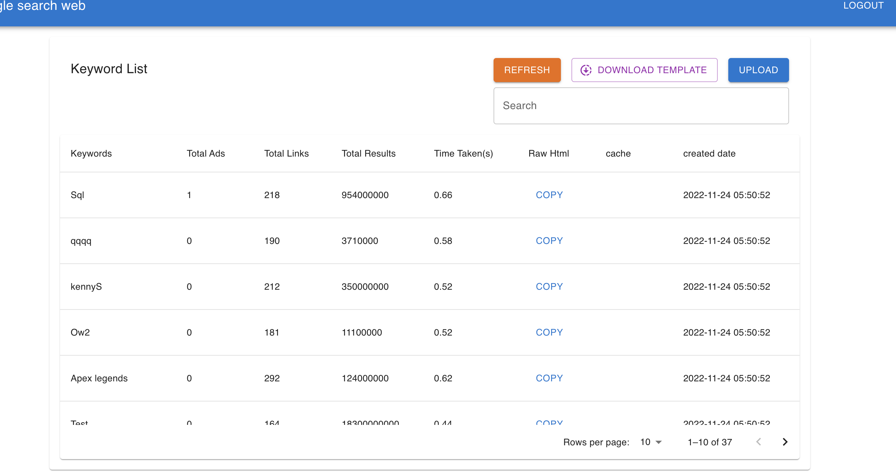

# To start server
### `npm install`
### `npm start`
Open [http://localhost:3000](http://localhost:3000) to view it in your browser.\
note: you will need to start backend server as well.

# User Manual
1.open http://localhost:3000 \
2.sign up tp create user.\

3.sign in.\

4.if you success sign in step you will see keyword list table.\

5.download template file to upload.\

6.fill your data in template file and upload it (only csv is available).

# Missing from requirements
1.refering to the requirements. \
a.Total number of AdWords advertisers on the page.\
b.Total number of links (all of them) on the page.\
c.Total of search results for this keyword e.g. About 21,600,000 results (0.42 seconds).\
d.HTML code of the page/cache of the page.\
From section d. I couldn't get cache of the page (there's cache links in the google api response but I don't think this is what you want).\
so next thing to do would be create button fetch links on every record in the keywords list table and display cache.

2.There's no test yet sorry for that I've never done any test before (including test from backend but I'm still learning it you will see tests file soon)

# Bugs
1.There's a bug in column created date I try to save local date on postgresql but the time is coverted when insert data to table.